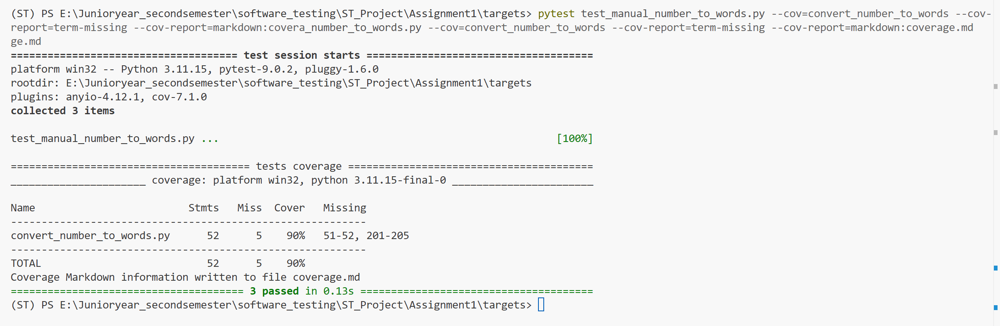

| Name                          |        Stmts |        Miss |         Cover |
| ----------------------------- | -----------: | ----------: | ------------: |
| convert\_number\_to\_words.py |           52 |           5 |           90% |
| **TOTAL**               | **52** | **5** | **90%** |

人工用例 Convert Number To Words.pdf，转化为Python 测试脚本（test_manual_number_to_words.py）
（严格按照 Convert Number To Words.pdf 中的 3 个函数 + 17 个 TC 设计，覆盖文档计算的所有独立路径）

### 1.  测试执行结果

* **`collected 3 items`** : 找到了 3 个测试函数（用例）。
* **`test_manual_number_to_words.py ... [100%]`** : 3 个用例全部运行完毕。
* **`3 passed in 0.13s`** :  **全部通过** ，没有报错，耗时 0.13 秒。
* **结论** ：你写的这 3 个人工测试用例逻辑是正确的，代码能跑通。

---

### 2. 覆盖率核心数据 (重点)

| 指标                        | 数值                     | 含义解读                                                        |
| :-------------------------- | :----------------------- | :-------------------------------------------------------------- |
| **Stmts**(总语句数)   | **52**             | 源文件 `convert_number_to_words.py`一共有 52 行可执行代码。   |
| **Miss**(未覆盖数)    | **5**              | 有 5 行代码**没有被**这 3 个测试用例执行到。              |
| **Cover**(覆盖率)     | **90%**            | **90% 的代码被覆盖了** 。这是一个非常高的人工基准分数！   |
| **Missing**(缺失行号) | **51-52, 201-205** | **具体没测到的地方** ：``1. 第 51-52 行``2. 第 201-205 行 |

测试用例全部通过，准确率100%

---
