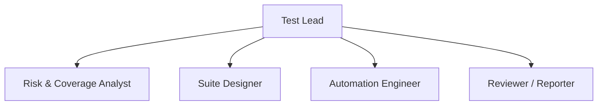

# todoitem Test Plan

## 1. Project Scope
This test plan covers the testing activities for `todoitem`. The current baseline contains 13 structured requirement(s), 77 coverage item(s), 44 test suite(s), and 1 high-risk requirement(s).

This plan is based on the current requirement baseline, the corresponding risk analysis, and the identified coverage items.

Testing background and overall objectives:
- Design testing activities for the functional behavior, input constraints, state changes, and exception handling explicitly stated in the current requirements.
- Prioritize high-risk requirements and preserve traceability across requirements, coverage items, test suites, and test cases.
- Give explicit attention to input validation, boundary conditions, and error handling when these are stated in the requirements.
- The current baseline contains 1 high-risk requirement(s), and their related test activities are included in the priority scope.

Items outside the detailed scope of this test plan:
- Fine-grained non-functional characteristics that are not explicitly stated in the current requirements are outside the main scope of this testing cycle.
- If dedicated security, performance, compatibility, or operational constraints are not stated in the requirements, they are mentioned only at a general risk level and are not expanded into detailed test design.

## 2. Test Items
Major functional characteristics:
- Todo Bulk Update
- Todo Cleanup
- Todo Completion
- Todo Creation
- Todo Deletion
- Todo Editing
- Todo Filter
- Todo Validation

Major non-functional or cross-cutting concerns:
- Basic reliability and persistence behavior
- Validation and safe failure handling

System architecture and major component description (abstracted from the available requirements):
- Major business component: Todo Bulk Update
- Major business component: Todo Cleanup
- Major business component: Todo Completion
- Major business component: Todo Creation
- Major business component: Todo Deletion
- Major business component: Todo Editing
- Major business component: Todo Filter
- Major business component: Todo Validation

## 3. High-Level Test Suite Design
The following test suites are derived from requirements, risk analysis, coverage items, and selected techniques. Only the core fields are retained in this document to support later detailed design.
For each suite, the selected technique reflects the coverage focus and the associated risk level of the underlying requirement set.

The number of suites listed below is consistent with the suites table: 44 suite(s).

| Suite ID | Suite Name | Risk Level | Techniques | Objective |
| --- | --- | --- | --- | --- |
| TS-001 | Todo Bulk Update Boundary | Medium | Boundary Value Analysis | Validate Todo Bulk Update behavior using Boundary Value Analysis for Boundary coverage, prioritized by requirement risk and coverage value. |
| TS-002 | Todo Bulk Update Decision Rule | Medium | Decision Table Testing | Validate Todo Bulk Update behavior using Decision Table Testing for Condition coverage, prioritized by requirement risk and coverage value. |
| TS-003 | Todo Bulk Update Partition Boundary | Medium | Equivalence Partitioning | Validate Todo Bulk Update behavior using Equivalence Partitioning for Boundary coverage, prioritized by requirement risk and coverage value. |
| TS-004 | Todo Bulk Update Partition Functional | Medium | Equivalence Partitioning | Validate Todo Bulk Update behavior using Equivalence Partitioning for Functional coverage, prioritized by requirement risk and coverage value. |
| TS-005 | Todo Bulk Update Partition Input | Medium | Equivalence Partitioning | Validate Todo Bulk Update behavior using Equivalence Partitioning for Input coverage, prioritized by requirement risk and coverage value. |
| TS-006 | Todo Bulk Update State Behavior | Medium | State Transition Testing | Validate Todo Bulk Update behavior using State Transition Testing for State Transition coverage, prioritized by requirement risk and coverage value. |
| TS-007 | Todo Cleanup Boundary | Medium | Boundary Value Analysis | Validate Todo Cleanup behavior using Boundary Value Analysis for Boundary coverage, prioritized by requirement risk and coverage value. |
| TS-008 | Todo Cleanup Decision Rule | Medium | Decision Table Testing | Validate Todo Cleanup behavior using Decision Table Testing for Condition coverage, prioritized by requirement risk and coverage value. |
| TS-009 | Todo Cleanup Partition Error | Medium | Equivalence Partitioning | Validate Todo Cleanup behavior using Equivalence Partitioning for Error coverage, prioritized by requirement risk and coverage value. |
| TS-010 | Todo Cleanup Partition Functional | Medium | Equivalence Partitioning | Validate Todo Cleanup behavior using Equivalence Partitioning for Functional coverage, prioritized by requirement risk and coverage value. |
| TS-011 | Todo Cleanup Partition Input | Medium | Equivalence Partitioning | Validate Todo Cleanup behavior using Equivalence Partitioning for Input coverage, prioritized by requirement risk and coverage value. |
| TS-012 | Todo Completion Boundary | Medium | Boundary Value Analysis | Validate Todo Completion behavior using Boundary Value Analysis for Boundary coverage, prioritized by requirement risk and coverage value. |
| TS-013 | Todo Completion Decision Rule | Medium | Decision Table Testing | Validate Todo Completion behavior using Decision Table Testing for Condition coverage, prioritized by requirement risk and coverage value. |
| TS-014 | Todo Completion Partition Input | Medium | Equivalence Partitioning | Validate Todo Completion behavior using Equivalence Partitioning for Input coverage, prioritized by requirement risk and coverage value. |
| TS-015 | Todo Completion State Functional | Medium | State Transition Testing | Validate Todo Completion behavior using State Transition Testing for Functional coverage, prioritized by requirement risk and coverage value. |
| TS-016 | Todo Completion State Transition | Medium | State Transition Testing | Validate Todo Completion behavior using State Transition Testing for State Transition coverage, prioritized by requirement risk and coverage value. |
| TS-017 | Todo Creation Boundary | Medium | Boundary Value Analysis | Validate Todo Creation behavior using Boundary Value Analysis for Boundary coverage, prioritized by requirement risk and coverage value. |
| TS-018 | Todo Creation Decision Rule | Medium | Decision Table Testing | Validate Todo Creation behavior using Decision Table Testing for Condition coverage, prioritized by requirement risk and coverage value. |
| TS-019 | Todo Creation Partition Functional | Medium | Equivalence Partitioning | Validate Todo Creation behavior using Equivalence Partitioning for Functional coverage, prioritized by requirement risk and coverage value. |
| TS-020 | Todo Creation Partition Input | Medium | Equivalence Partitioning | Validate Todo Creation behavior using Equivalence Partitioning for Input coverage, prioritized by requirement risk and coverage value. |
| TS-021 | Todo Creation State Transition | Medium | State Transition Testing | Validate Todo Creation behavior using State Transition Testing for State Transition coverage, prioritized by requirement risk and coverage value. |
| TS-022 | Todo Deletion Boundary | Medium | Boundary Value Analysis | Validate Todo Deletion behavior using Boundary Value Analysis for Boundary coverage, prioritized by requirement risk and coverage value. |
| TS-023 | Todo Deletion Decision Rule | Medium | Decision Table Testing | Validate Todo Deletion behavior using Decision Table Testing for Condition coverage, prioritized by requirement risk and coverage value. |
| TS-024 | Todo Deletion Partition Functional | Medium | Equivalence Partitioning | Validate Todo Deletion behavior using Equivalence Partitioning for Functional coverage, prioritized by requirement risk and coverage value. |
| TS-025 | Todo Deletion Partition Input | Medium | Equivalence Partitioning | Validate Todo Deletion behavior using Equivalence Partitioning for Input coverage, prioritized by requirement risk and coverage value. |
| TS-026 | Todo Deletion State Behavior Suite | Medium | State Transition Testing | Validate error handling when deleting a non-existent todo item using state transition testing. |
| TS-027 | Todo Editing Boundary Suite | High | Boundary Value Analysis | Validate boundary conditions for todo editing inputs (todoId, newTitle) using boundary value analysis. |
| TS-028 | Todo Editing Decision Rule Suite | High | Decision Table Testing | Validate decision rules for todo editing (double-click, existence, empty title, escape) using decision table testing. |
| TS-029 | Todo Editing Partition Suite | High | Equivalence Partitioning | Validate core editing functions (update, delete, cancel) using equivalence partitioning. |
| TS-030 | Todo Editing Input Partition Suite | High | Equivalence Partitioning | Validate input fields (todoId, newTitle) with valid and invalid data using equivalence partitioning. |
| TS-031 | Todo Editing Error State Suite | Medium | State Transition Testing | Validate error state transitions for todo editing (non-existent item, empty title deletion) using state transition testing. |
| TS-032 | Todo Editing Enter Edit Suite | Medium | State Transition Testing | Validate entering edit mode via double-click using state transition testing. |
| TS-033 | Todo Editing Escape State Suite | Medium | State Transition Testing | Validate state transition when pressing Escape during edit reverts title and exits edit mode. |
| TS-034 | Todo Filter Boundary Suite | Medium | Boundary Value Analysis | Validate boundary conditions for listId input in todo filtering using boundary value analysis. |
| TS-035 | Todo Filter Decision Rule Suite | Medium | Decision Table Testing | Validate filter returns correct items when list has items in all three states using decision table testing. |
| TS-036 | Todo Filter Partition Suite | Medium | Equivalence Partitioning | Validate boundary values for filter parameter (All, Active, Completed) using equivalence partitioning. |
| TS-037 | Todo Filter Functional Suite | Medium | Equivalence Partitioning | Validate core filter functionality using equivalence partitioning. |
| TS-038 | Todo Filter Input Partition Suite | Medium | Equivalence Partitioning | Validate input fields (listId, filter) with valid and invalid data using equivalence partitioning. |
| TS-039 | Todo Validation Boundary Suite | Medium | Boundary Value Analysis | Validate boundary conditions for title input (whitespace, length) using boundary value analysis. |
| TS-040 | Todo Validation Decision Rule Suite | Medium | Decision Table Testing | Validate decision rules for title validation (whitespace, empty, length) using decision table testing. |
| TS-041 | Todo Validation Functional Suite | Medium | Equivalence Partitioning | Validate core validation functions (trim, reject empty, reject long) using equivalence partitioning. |
| TS-042 | Todo Validation Input Partition Suite | Medium | Equivalence Partitioning | Validate input field 'title' with valid and invalid data using equivalence partitioning. |
| TS-043 | Todo Validation Error State Suite | Medium | State Transition Testing | Validate error state when rejecting empty/whitespace-only title during creation and editing using state transition testing. |
| TS-044 | State Transition Model Suite | Medium | State Transition Testing | Validate all state transitions (TR-001 to TR-013) using optimized transition sequence for full coverage. |

## 4. Schedule / Checklist
| Phase | Focus | Checkpoint |
| --- | --- | --- |
| Requirement and risk review | Confirm the test boundary and identify high-risk requirements | Structured requirements completed and 1 high-risk requirement(s) identified |
| Coverage and strategy design | Select test techniques for major coverage targets | Coverage items and test strategies reviewed and accepted |
| Test suite design | Prioritize high-risk suites and confirm suite objectives | 44 suite(s) generated, including 4 high-risk suite(s) |
| Test case design and review | Produce executable and traceable test cases | Test cases and traceability matrix generated and checked |
| Export and reporting | Deliver the final document and structured artifacts | Markdown test plan, suites, cases, and traceability exported |

## 5. Organization Structure
### Responsibility Summary
| Role | Responsibility |
| --- | --- |
| Test Lead | Owns the overall test plan, milestone checks, and final review. |
| Risk & Coverage Analyst | Analyzes requirements, risks, and coverage to keep the scope complete. |
| Suite Designer | Designs high-level test suites, selects techniques, and defines suite objectives. |
| Automation Engineer | Turns the test design into executable tests and integrates them with the selected frameworks. |
| Reviewer / Reporter | Checks traceability, consolidates evidence, and prepares the final outputs. |

### Organization Chart

## 6. Selected Test Frameworks and Rationale
| Framework / Tool | Rationale |
| --- | --- |
| PyTest | Used as the main execution framework for automated tests, assertions, regression organization, and result reporting. |
| Selenium | Used for browser-level interaction and end-to-end workflow validation when the target application includes user-facing scenarios. |
| JUnit | Can be used as a complementary framework for unit-level or component-level regression checks when the target application includes Java-side tests. |

## 7. Cost Estimation
The following estimate is expressed in person-days based on the current testing arrangement, suite volume, and test case design effort. It is intended for planning and for comparison with a manual test design baseline.

| Work Item | Estimated Person-Days |
| --- | ---: |
| Requirement analysis and risk assessment | 1.3 |
| Coverage and test strategy design | 3.1 |
| Test suite and state-behavior design | 6.6 |
| Test case generation and review | 5.3 |
| Result consolidation and document export | 0.5 |
| **Total** | **16.8** |

## 8. Current Artifact Summary
- Structured requirements: 13
- Risks: 13
- Coverage items: 77
- State transition sequences: 13
- Test suites: 44
- Test cases: 176
